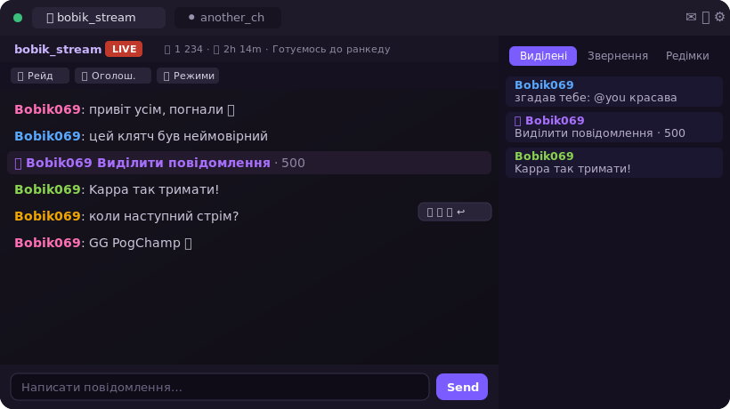

# StickiChat

**StickiChat** — десктопний клієнт чату Twitch для стрімерів і модераторів. Кілька каналів поруч, повна модерація, віспери, підсвітки, кастомний OBS-оверлей та багато дрібниць, зроблених під зручність української спільноти.

> Неофіційний застосунок. Не пов'язаний з Twitch Interactive, Inc.



> Зображення — стилізований мокап (ніки-заглушки `Bobik069`), не реальні користувачі.

---

## Можливості

**Чат і кілька каналів**
- Кілька каналів одночасно: вкладки + спліт-скрін, окремі вікна, перетягування панелей.
- Історія чату при вході, збереження стану між вкладками й вікнами.
- Емоути Twitch / 7TV / BTTV / FFZ, бейджі, чирмоти (біти), повний емодзі-пікер з каомодзі й обраним.
- Клікабельні посилання, ПКМ-копіювання ніків / емоутів / `!команд`, передпоказ емоута при наведенні.
- Фільтр вкладок «усі / онлайн / офлайн», окремий зум вкладок, пауза чату на утримання клавіші.

**Модерація**
- Бан / таймаут / видалення / попередження — кнопками, свайпом або хоткеями.
- Налаштовувані мод-кнопки з мультивибором каналів.
- Стрічка мод-дій (хто кого забанив/таймаутнув) через EventSub.
- Картка користувача: історія повідомлень, підписка/фоловінг, правила чату каналу.

**Підсвітки та події**
- Панель/вікно виділених: згадки, редімки, кастомні правила підсвітки.
- Редімки з іконкою балів каналу, назвою нагороди й кольоровим ніком.
- Рейди, шаутаути, сабки, біти, старт стріму — з опційними звуками й банерами.
- Віспери (приватні повідомлення) з історією, емоутами та обраними співрозмовниками.

**OBS-оверлей**
- Локальний прозорий Browser Source з живим оновленням стилю.
- Іменовані профілі: шрифт, кольори, обводка, тінь, свічення, підкладка, кастомне зображення.
- Приховані користувачі, події, що показувати — усе під профіль.

**Дрібниці під українську спільноту**
- Перемикач розкладки «забув перемкнути» (укр⇄eng) з врахуванням регістру й винятками.
- Українські тексти подій і помилок, двомовний емодзі-пошук.
- Опційні 7TV-кольори ніків, читабельність ніків на світлій/темній темі.

---

## Встановлення

Завантаж останній інсталятор для Windows зі сторінки [Releases](../../releases) і запусти `.exe`.

> Застосунок поки без сертифіката підпису, тож Windows SmartScreen може показати попередження «Windows захистив ваш ПК» — натисни **Детальніше → Виконати попри це**. Автооновлення вбудоване.

---

## Розробка

```bash
npm install
npm run dev        # запуск у режимі розробки (electron-vite)
npm run build      # збірка
npm run dist       # інсталятор Windows (electron-builder)
```

**Стек:** Electron + React 18 + Zustand + TypeScript, electron-vite, react-virtuoso. Twitch IRC (WebSocket), Helix, EventSub, PubSub.

---

## Скріншоти

Реальні знімки з живого чату варто додати сюди (у `docs/`), використовуючи тестовий канал і ніки-заглушки замість реальних користувачів. Мокап вище показує загальний вигляд.

---

Автор: **GouS_Stickmen** · [github.com/GouSsStickmen/stickichat](https://github.com/GouSsStickmen/stickichat)
